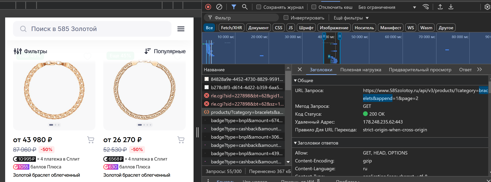

# GoldParseBot

## Описание
GoldParseBot — Телеграм-бот с функцией парсера одного крупного сайта ювелирных изделий.

## Как это работает?

Вы пишете боту "Парси браслеты" или "Парси цепи", а он в ответ присылает вам Excel-таблицу, где вы можете отсортировать и выбрать самую выгодную позицию.

## Как начать работу с проектом?

### 1. Клонируйте репозиторий:
```bash
git clone git@github.com:Cubaser/zolotoy.git
cd zolotoy/
```

### 2. Установка виртуального окружения и зависимостей
Активируйте виртуальное окружение и установите необходимые библиотеки:
```bash
python3 -m venv venv
source venv/bin/activate  # для Linux/macOS
source venv/Scripts/activate  # для Windows
pip install -r requirements.txt
```

### 3. Настройка переменных окружения
Создайте в корне проекта файл `.env` со следующим содержимым:
```env
BOT_TOKEN=<Токен вашего телеграм-бота>
BRACELET_URL=<Ключ по выборке браслетов>
CHAIN_URL=<Ключ по выборке цепей>
USERS=<ID пользователя с доступом>,<ID пользователя с доступом>,<ID пользователя с доступом>
INTERVAL=<Числовое значение временной задержки (в секундах)>
X_QA_CLIENT_TYPE=<Значение из хедера>
X_QA_REGION=<Значение из хедера>
```

### Где взять BOT_TOKEN, BRACELET_URL, CHAIN_URL и заголовки?
1. BOT_TOKEN можно получить, создав бота в [@BotFather](https://t.me/BotFather).
2. BRACELET_URL и CHAIN_URL можно найти в инструменте разработчика браузера, настроив выборку и найдя запрос /products/?category=....
3. Заголовки X_QA_CLIENT_TYPE и X_QA_REGION находятся там же в разделе "Заголовки запросов".

Пример выделения ключа:



Запустите сервер:
```bash
python main.py
```

### Основные технологии:
- **Python**
- **TeleBot**
- **OpenPyXL**

---

## Автор
Иванов Виктор  
✉️ [cubaser@mail.ru](mailto:cubaser@mail.ru)
